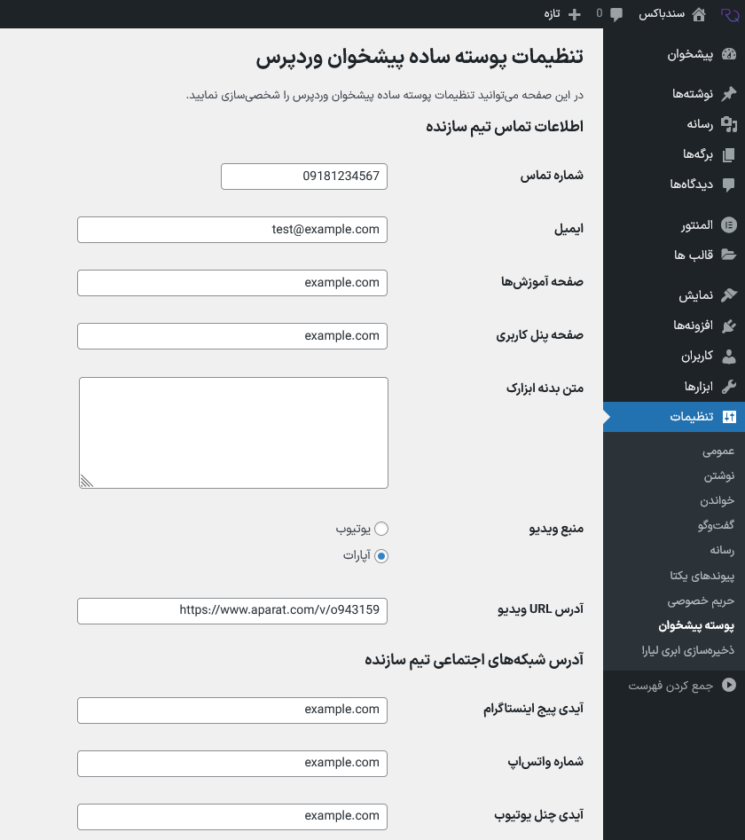
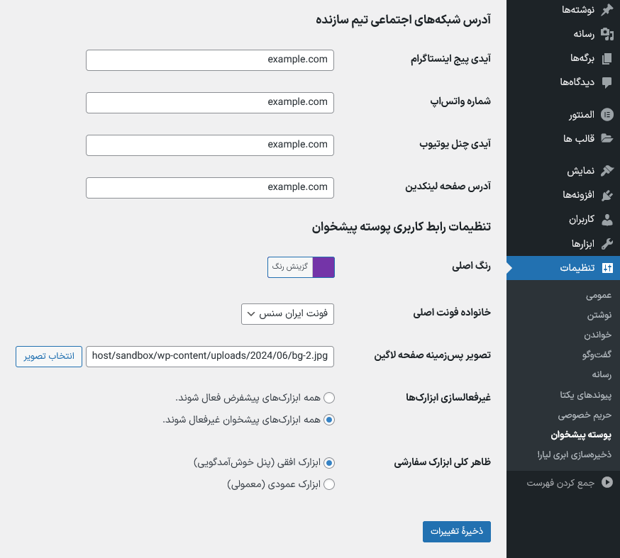
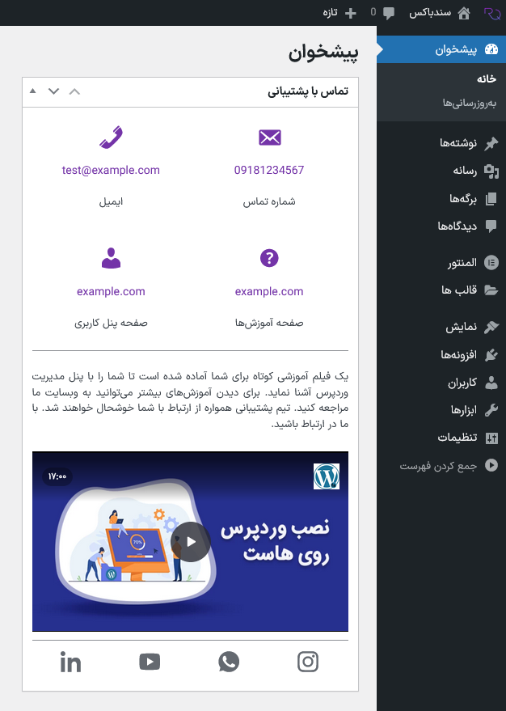
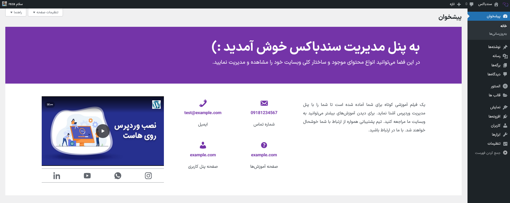
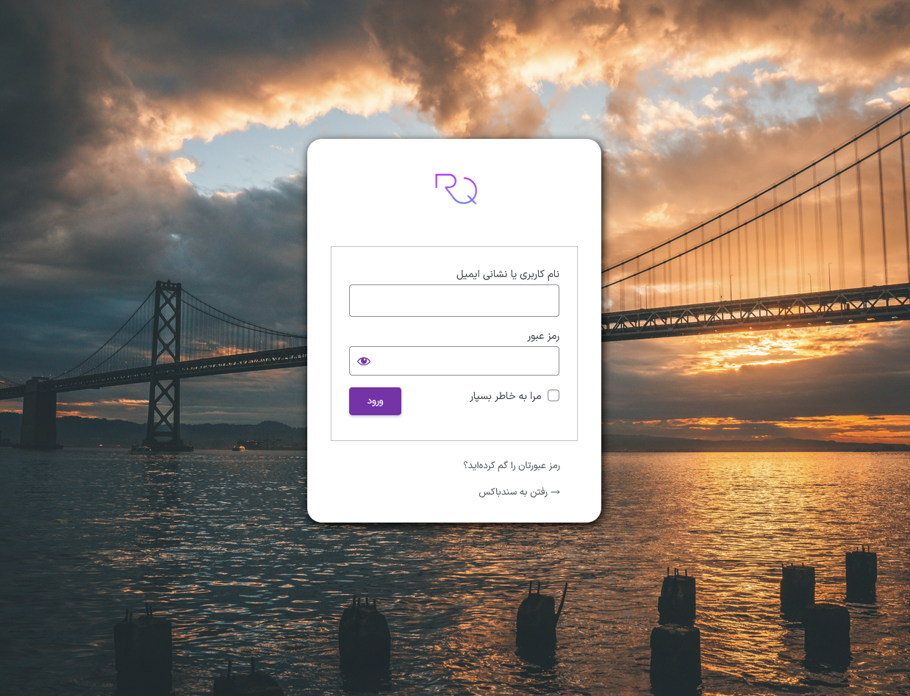

# Simple Admin Dashboard Theme
This plugin allows you to customize the fonts and colors of your WordPress admin panel. You can also add a background image to the login page. Additionally, it provides two types of customizable widgets for displaying support information to your clients.

# How to Use
To access the plugin settings, go to the `Settings > Admin Dashboard` from the admin menu and adjust the fields as desired.

## Multi-Lingual
The plugin supports internationalization (i18n) through translation files (`po/mo`). The provided **.pot** file helps you translate the plugin into your preferred language. If the language files do not load your locale, copy the `po/mo` files from **/languages** directory to the **/wp-content/languages/plugins** directory in your WordPress installation.

> **Note:** All text in the plugin can be customized using `po/mo` files located in the **/languages** directory.

## Widgets
There are two options for the support widget that you can select in the plugin settings.
a) Vertical Widget (Regular):

b) Horizontal Widget (Welcome Screen):

## Login Page
The logo, color, and background image for the login page forms are customizable using the plugin:
